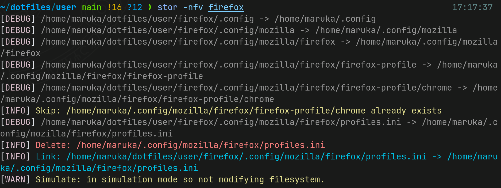

# Stor

Stor is an alternative to GNU Stow. It has more features and easy to use.

```shell
stor -t $HOME path/to/module
```



Stor also has some flags like stow:

- -t, --target DIR: target dir (defaults to $HOME)
- -n, --simulate: dry-run
- -D, --delete: remove previously linked or copied items
- -V, --version: show version number

and feature new:

- -c, --copy: copy instead of creating symlinks
- -f, --overwrite: if target file/dir exists, overwrite it without ask
- -v, --verbose / -q, --quiet: change log verbosity

Some features are removed since not that useful:

- -d, --dir DIR is used to set workdir, but now module supports a path rather than a name.

Advanced features is supposed to be added later:

- --ignore <regex/glob> to ignore patterns
- --adopt: used with -t, adopt a dir as a module then link/copy it to its original place

## Example

A usecase is like:

Assuming you have this structure:

```markdown
dotfiles/
└── modules/
    ├── vim/
    └── ...
```

Deploy all modules to your home directory with:

```shell
cd dotfiles
stor -t $HOME modules/*/
```

This creates symlinks or copies from `modules/*/…` into `$HOME/…` while preserving relative paths.

Since $HOME is the default target, the same result can be achieved with:

```shell
stor modules/*/
```

To recover changes, you can use the flag `-D`:

```shell
stor -D modules/*/
```

To see what will be changed, use `-n` or `--simulate` before you execute any action:

```shell
stor -n modules/*/
```

## Install

- Cargo:

```shell
cargo install --git "https://github.com/levinion/stor"
```

- AUR:

```shell
paru [or yay] -S stor
```

- Git:

```shell
git clone "https://github.com/levinion/stor"
cd stor
make
```
