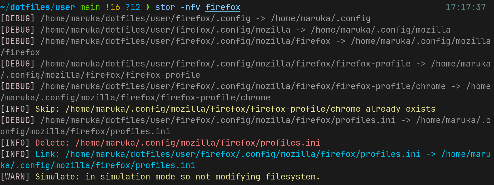

# Stor

Stor is an alternative to GNU Stow. It has more features and is easy to use.

```shell
stor -t $HOME path/to/module
```



## Quick start

A *module* is a directory whose contents mirror paths relative to the target
directory (by default `$HOME`). `stor` walks the module and creates symlinks in
the target, preserving relative paths.

Say your dotfiles repo looks like this:

```
dotfiles/
├── git/
│   └── .gitconfig
└── nvim/
    └── .config/
        └── nvim/
            └── init.lua
```

Deploy everything to `$HOME` (assuming `~/.config` already exists, as it does
on most machines):

```shell
cd dotfiles
stor -t $HOME git nvim
```

```
[INFO] Link: /home/you/dotfiles/git/.gitconfig -> /home/you/.gitconfig
[INFO] Link: /home/you/dotfiles/nvim/.config/nvim -> /home/you/.config/nvim
```

Result:

```
~/
├── .config/
│   └── nvim      -> dotfiles/nvim/.config/nvim
└── .gitconfig    -> dotfiles/git/.gitconfig
```

Since `$HOME` is the default target, the same thing can be written as:

```shell
stor git nvim
```

Multiple modules, globs and full paths all work:

```shell
stor modules/*/
stor /path/to/dotfiles/git /path/to/dotfiles/nvim
```

> **Note:** `stor` links the *outermost* path that does not exist in the target
> yet. Because `~/.config` already existed above, `~/.config/nvim` was linked.
> On a machine without `~/.config` (e.g. a fresh install), the whole directory
> would be linked instead: `~/.config -> dotfiles/nvim/.config`. Either way,
> the relative layout inside the module is preserved.

## Install

- Cargo:

```shell
cargo install --git "https://github.com/levinion/stor"
```

- AUR:

```shell
$AUR_HELPER -S stor
```

- Git:

```shell
git clone "https://github.com/levinion/stor"
cd stor
make
```

## Flags

| Flag | Description |
| --- | --- |
| `-t, --target DIR` | target directory (defaults to `$HOME`) |
| `-n, --simulate` | dry-run; print what would happen, change nothing |
| `-D, --delete` | unstow: remove previously linked/copied items |
| `-R, --restow` | unstow then stow again |
| `-c, --copy` | copy instead of creating symlinks |
| `-f, --overwrite` | replace existing files/dirs instead of skipping them |
| `-v, --verbose` / `-q, --quiet` | change log verbosity |
| `-I, --ignore <GLOB>` | ignore matching patterns (repeatable) |
| `--adopt` | adopt existing files/dirs in the target into the module, then link/copy them back |
| `-i, --interactive` | ask for confirmation before each action |
| `-V, --version` | show version |

Removed since they weren't that useful:

- `-d, --dir DIR` — used to set the working directory; modules are now given as paths, so a separate workdir is unnecessary.

## Examples

### See what will change (dry-run)

Before touching anything, preview what `stor` would do. Nothing is modified:

```shell
stor -n nvim
```

```
[INFO] Link: /home/you/dotfiles/nvim/.config/nvim -> /home/you/.config/nvim
[WARN] Simulate: in simulation mode so not modifying filesystem.
```

### Copy instead of linking

Some programs rewrite their config in place, or you may want each machine to
have its own independent copy. Use `-c` to copy the files instead of linking
them:

```shell
stor -c nvim
```

Keep in mind copies are one-way: edits made under `$HOME` do not propagate back
into the module (with symlinks they do, since both paths point to the same
file).

### Overwrite existing files

By default `stor` leaves existing files alone and prints a warning:

```
[WARN] Skip: /home/you/.gitconfig is not overwritten
```

To replace them, add `-f`:

```shell
stor -f git
```

### Ignore files and directories

Skip patterns with `-I` (repeatable, glob syntax). Patterns also apply on
unstow/restow, so ignored files are left untouched in the target:

```shell
stor -I '**/.git' -I '**/node_modules' nvim
```

### Undo (unstow)

Remove everything a module linked/copied into the target:

```shell
stor -D nvim
```

```
[INFO] Unlink: /home/you/.config/nvim
```

Empty parent directories created for the links are cleaned up too. The target
directory itself is never removed, and the module directory is left untouched.

### Restow

When a linked file was replaced by a real file (e.g. an app wrote to it),
re-create the links with `-R` (unstow, then stow again):

```shell
stor -R nvim          # will not clobber real files
stor -R -f nvim       # force: replace real files and link again
```

### Adopt existing files

You have been configuring a machine by hand and want to version-control those
files. `--adopt` moves the live files from the target into the module, then
links them back:

```shell
# ~/.config/nvim/  contains your hand-tuned real config
# modules/nvim/    contains placeholders (or is empty)
stor --adopt nvim
```

```
[INFO] Adopt: /home/you/.config/nvim -> /home/you/dotfiles/nvim/.config/nvim
[INFO] Link: /home/you/dotfiles/nvim/.config/nvim -> /home/you/.config/nvim
```

The live files now live in the repo and are managed by `stor`. Works with the
default `$HOME` target too; combine with `-c` to copy instead of linking.

### Interactive mode

Confirm each link/copy/adopt/delete with `-i`:

```shell
stor -i nvim
```

## Config

Stor can be configured with TOML files. Config is optional and all fields are optional.

### Global config

`$XDG_CONFIG_HOME/stor/stor.toml` (or `~/.config/stor/stor.toml` if `$XDG_CONFIG_HOME` is not set) applies to all modules:

```toml
# Patterns to exclude from stor
ignore = ["**/.git", "**/.DS_Store"]
```

### Project config

A `stor.toml` located in the root of a module configures that module and merges with the global config:

```toml
ignore = ["**/.cache"]
```

The project `stor.toml` itself is never stowed. Patterns from `-I, --ignore` are applied on top of the config.
